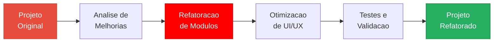

# Refatorando o Projeto de Hotel e Hospedagem com OutSystems

**[PT-BR](#sobre-o-projeto) | [English](#about-the-project)**

---

## Sobre o Projeto

> Desafio de projeto da [DIO (Digital Innovation One)](https://www.dio.me/)

Este projeto e a **refatoracao** do [sistema de hotel e hospedagem](https://github.com/galafis/Criando-um-Sistema-para-Hotel-e-Hospedagem-com-OutSystems) desenvolvido anteriormente com OutSystems. O foco esta em melhorar a arquitetura, a experiencia do usuario e a manutencao do codigo, aplicando principios de refatoracao como separacao de responsabilidades, reutilizacao de componentes e otimizacao de fluxos.

---

## Fluxo de Refatoracao

---

## Conteudo

| Arquivo | Descricao |
|---|---|
| `RefatoracaoDIOHotel.oml` | Projeto OutSystems refatorado |
| `LICENSE` | Licenca MIT |

## Como Executar

1. Clone este repositorio
2. Importe o arquivo `.OML` no **OutSystems Service Studio**
3. Compile e publique no Service Center
4. Acesse pelo navegador

## Melhorias Implementadas

- Separacao de responsabilidades entre modulos
- Reutilizacao de componentes de UI
- Otimizacao de fluxos de navegacao
- Melhoria na experiencia do usuario

## Aplicacao na Industria

A refatoracao e uma pratica essencial em desenvolvimento de software, permitindo que sistemas legados sejam modernizados sem reescrita completa, reduzindo custos e riscos.

---

## English

### About the Project

> Project challenge from [DIO](https://www.dio.me/)

This project is the **refactoring** of the [hotel and hospitality system](https://github.com/galafis/Criando-um-Sistema-para-Hotel-e-Hospedagem-com-OutSystems) previously developed with OutSystems. The focus is on improving architecture, user experience, and code maintainability by applying refactoring principles.

---

## Licenca | License

Este projeto esta licenciado sob a [Licenca MIT](LICENSE). | This project is licensed under the [MIT License](LICENSE).

---

Developed by [Gabriel Demetrios Lafis](https://github.com/galafis)
